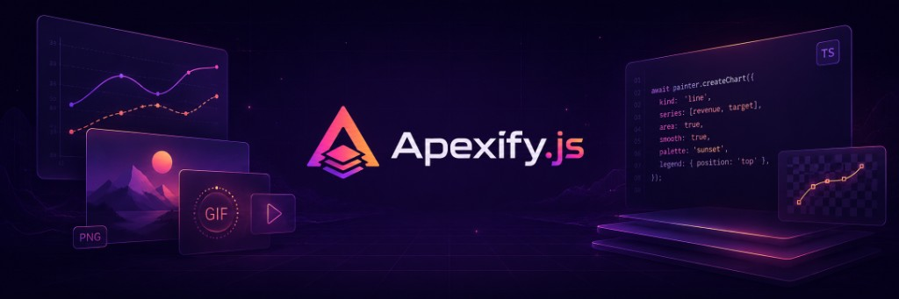

# Apexify.js

<div align="center">



**Programmatic visual generation for Node.js.**

Create images, charts, text effects, shapes, GIFs, MP4/video, **scenes**, **templates**, and composed layouts from JavaScript or TypeScript.

[](https://www.npmjs.com/package/apexify.js)
[](https://www.npmjs.com/package/apexify.js)
[](https://www.typescriptlang.org/)
[](https://nodejs.org/)
[](LICENSE)

[Documentation](https://apexifyjs.vercel.app/docs#00-start-here) ·
[Gallery](https://apexifyjs.vercel.app/gallery) ·
[Studio](https://apexifyjs.vercel.app/studio) ·
[npm](https://www.npmjs.com/package/apexify.js)

</div>

---

## What is Apexify.js?

**Apexify.js** is a TypeScript-first Node.js rendering library for generating visual assets from code.

It is built for developers who need to create images, charts, banners, cards, reports, GIFs, or video-related outputs without manually designing every asset.

Apexify.js combines:

- canvas rendering
- image composition
- text rendering
- shape drawing
- chart generation
- GIF creation
- video processing
- layered **scenes** and **templates** (`renderScene`, placeholders, **`$`** assets)
- lightweight **components** (**`badge`**, **`progressBar`**, **`avatar`**, **`card`**, **`watermark`** → **`SceneLayer[]`**)
- **plugins** (**`PluginHost`** + **`ApexPainter.use`**)
- batch / chain helpers and batch output utilities
- pixel/path/hit-testing APIs

under one programmable workflow.

---

## Install

```bash
npm install apexify.js
```

```bash
yarn add apexify.js
```

```bash
pnpm add apexify.js
```

### Requirements

- Node.js 16+
- TypeScript recommended
- FFmpeg required only for video features

---

## Quick Start

Create a canvas, draw text on it, and save the result.

```ts
import { writeFileSync } from "node:fs";
import { ApexPainter } from "apexify.js";

const painter = new ApexPainter({ type: "buffer" });

const base = await painter.createCanvas({
  width: 1200,
  height: 630,
  gradientBg: {
    type: "linear",
    startX: 0,
    startY: 0,
    endX: 1200,
    endY: 630,
    colors: [
      { stop: 0, color: "#667eea" },
      { stop: 1, color: "#764ba2" },
    ],
  },
});

const output = await painter.createText(
  {
    text: "Hello Apexify.js",
    x: 600,
    y: 315,
    font: { size: 72, family: "Arial" },
    decorations: { bold: true },
    fill: { color: "#ffffff" },
    placement: { textAlign: "center", textBaseline: "middle" },
    effects: {
      shadow: {
        color: "rgba(0,0,0,0.35)",
        offsetX: 0,
        offsetY: 14,
        blur: 28,
        opacity: 1,
      },
    },
  },
  base
);

writeFileSync("output.png", output);
```

---

## Named assets (`$name`, `$palette.key`)

Register images, fonts, and color palettes on **`painter.assets`**.

- **Scenes** (`renderScene`, `renderSceneToGIF`, `renderSceneToVideoFrames`): `$refs` in strings are resolved **by default** (use `{ resolveAssetRefs: false }` to skip).
- **Templates**: resolved when you call **`TemplateHandle.render`**.
- **`SceneBuilder.render`**: opt in with **`{ resolveAssetRefs: true }`**.

**Imperative** APIs (`createCanvas`, `createImage`, `createText`, `measureText`, chart methods, `createGIF`, `animate`, `createVideo`) leave **`$refs`** unchanged unless you pass **`{ resolveAssetRefs: true }`** on the trailing options argument (where supported), or preprocess once with **`painter.prepareForRender(config)`**. **`batch`** and **`chain`** accept **`{ resolveAssetRefs: true }`** (and optional **`resolve`**) to resolve each batch **`config`** or each chained **`args`** value.

Minimal example:

```ts
painter.assets.loadPalette("brand", { primary: "#6366f1", ink: "#0f172a" });
await painter.createCanvas(
  { width: 400, height: 200, colorBg: "$brand.primary" },
  { resolveAssetRefs: true }
);
// or build config first:
const cfg = painter.prepareForRender({
  width: 400,
  height: 200,
  colorBg: "$brand.primary",
});
await painter.createCanvas(cfg);
```

---

## Scenes, templates, and components

**Scenes** — Layered compositions (**`SceneLayer[]`**: image, text, path, chart, nested **`surface`**, …).

- **`createScene`** returns **`SceneBuilder`**: **`addLayers`**, stack editing (**`insertLayer`**, **`moveLayer`**, …), **`toRenderInput()`**, **`render()`**. Use **`render({ resolveAssetRefs: true })`** when layers contain **`$…`** asset strings (same rules as **`renderScene`** if the builder was created via **`createScene`**).
- **`renderScene`**, **`renderSceneToGIF`**, **`renderSceneToVideoFrames`** — PNG / GIF / video; string **`$refs`** resolve **by default** (pass **`{ resolveAssetRefs: false }`** on the matching options bag to skip).
- **`validateSceneRenderInput`** — checks dimensions and nested **`surface`** depth for untrusted payloads.

**Templates** — **`createTemplate(definition, options?)`** returns **`TemplateHandle`**: placeholders **`{{key}}`** / **`{{key \| default}}`**, **`$`** assets, flex **`layout`**, **`visible`**, layer **`id`** + render **`overrides`**.

**Components** — **`painter.components`**: **`badge`**, **`progressBar`**, **`avatar`**, **`card`**, **`watermark`**; each **`toLayers(options)`** returns **`SceneLayer[]`** for **`renderScene`** or **`SceneBuilder.addLayers`**.

**Plugins** — **`painter.plugins.use(name, api)`** registers a named API object; **`painter.use(plugin)`** installs an **`ApexifyPlugin`** once per **`plugin.name`** (**`plugin.install(this)`**).

---

## Core Workflow

Typical flows:

```txt
Imperative → createCanvas → createText / createImage / … → Buffer → save()
Scenes     → renderScene | createTemplate().render() | SceneBuilder.render()
```

Classic buffer pipeline:

```txt
createCanvas()
     ↓
createText() / createImage() / createChart() / createScene()…
     ↓
save() / outPut() / return Buffer
```

Most drawing APIs return a **`Buffer`**; **`createCanvas`** returns **`CanvasResults`** (`buffer` plus metadata). Results can be saved, streamed, chained, or passed into **`renderScene`**, GIF/video helpers, or **`batch`** / **`chain`**.

---

## Why Use Apexify.js?

Apexify.js is useful when your application needs to generate visuals automatically.

Examples:

- dynamic Open Graph images
- social media banners
- Discord welcome cards
- product cards
- certificates
- reports and chart images
- dashboard snapshots
- animated GIFs
- video thumbnails
- frame-based videos
- batch-generated marketing assets

Instead of designing every asset manually, you define the visual structure in code and generate outputs on demand.

---

## Main Features

### Canvas & Backgrounds

Create base canvases with solid colors, gradients, images, layered backgrounds, patterns, noise, shadows, borders, and transformations.

```ts
const { buffer } = await painter.createCanvas({
  width: 1200,
  height: 630,
  colorBg: "#0f172a",
});
```

Supported background tools include:

- solid colors
- linear, radial, and conic gradients
- image backgrounds
- video frame backgrounds
- layered backgrounds with `bgLayers`
- pattern overlays
- noise effects
- borders and shadows

---

### Text Rendering

Render styled text with layout control, gradients, shadows, strokes, glow effects, decorations, wrapping, custom fonts, rotation, and curved text.

```ts
const output = await painter.createText(
  {
    text: "Apexify.js",
    x: 600,
    y: 300,
    font: { size: 80, family: "Arial" },
    decorations: { bold: true },
    fill: { color: "#ffffff" },
    placement: { textAlign: "center", textBaseline: "middle" },
  },
  canvasBuffer
);
```

Text capabilities include:

- font size and family
- custom fonts
- bold and italic
- alignment and baseline control
- wrapping
- gradients
- shadows
- strokes
- glows
- underline, overline, strikethrough
- curved text
- text metrics

---

### Images & Shapes

Draw images or vector-style shapes on top of an existing canvas.

```ts
const output = await painter.createImage(
  {
    source: "rectangle",
    x: 100,
    y: 100,
    width: 400,
    height: 220,
    shape: {
      fill: true,
      color: "#ffffff",
    },
    borderRadius: 32,
    shadow: {
      color: "rgba(0,0,0,0.25)",
      offsetX: 0,
      offsetY: 16,
      blur: 32,
    },
  },
  canvasBuffer
);
```

Image and shape features include:

- bitmap drawing
- shape drawing
- resizing
- cropping
- masking
- clipping
- rotation
- opacity
- shadows
- strokes
- blend modes
- filters
- group transforms
- perspective and distortion tools

---

### Charts

Generate static chart images directly from data.

```ts
const chart = await painter.createChart(
  "line",
  [
    {
      label: "Revenue",
      data: [
        { x: 1, y: 12 },
        { x: 2, y: 18 },
        { x: 3, y: 24 },
        { x: 4, y: 31 },
        { x: 5, y: 42 },
      ],
      color: "#7c3aed",
    },
  ],
  {
    dimensions: { width: 900, height: 500 },
    labels: {
      title: { text: "Revenue growth", fontSize: 18, color: "#0f172a" },
    },
  }
);
```

Supported chart types include:

- pie
- donut
- bar
- horizontal bar
- line
- scatter
- radar
- polar area
- comparison charts
- combo charts

---

### GIF Creation

Create animated GIFs from frames, buffers, image paths, or programmatic frame generation.

```ts
const gif = await painter.createGIF(undefined, {
  width: 600,
  height: 600,
  frameCount: 30,
  delay: 40,
  outputFormat: "buffer",
  async onStart(frameCountHint, _painter) {
    const frames: { buffer: Buffer; duration: number }[] = [];

    for (let i = 0; i < frameCountHint; i++) {
      const canvas = await painter.createCanvas({
        width: 600,
        height: 600,
        colorBg: "#111827",
      });

      const frame = await painter.createText(
        {
          text: `Frame ${i + 1}`,
          x: 300,
          y: 300,
          font: { size: 48, family: "Arial" },
          fill: { color: "#ffffff" },
          placement: { textAlign: "center", textBaseline: "middle" },
        },
        canvas
      );

      frames.push({
        buffer: frame,
        duration: 40,
      });
    }

    return frames;
  },
});
```

GIF features include:

- frame-based animation
- custom frame duration
- programmatic frame generation
- transparent color support
- per-frame disposal
- watermark support
- buffer, file, base64, and attachment outputs

---

### Video Processing

Apexify.js includes FFmpeg-backed video utilities for workflows such as metadata extraction, frame extraction, conversion, trimming, thumbnails, audio operations, transitions, and frame-to-video encoding.

```ts
const info = await painter.createVideo({
  source: "./input.mp4",
  getInfo: true,
});
```

Create a video from generated image buffers (requires FFmpeg):

```ts
await painter.createVideo({
  source: "",
  createFromFrames: {
    frames: [frameBuf1, frameBuf2, frameBuf3],
    outputPath: "./output.mp4",
    fps: 30,
    format: "mp4",
    quality: "high",
  },
});
```

> Video features require FFmpeg and ffprobe to be available on the host system.

---

### Advanced APIs

Apexify.js also exposes lower-level APIs on **`painter.path2d`**, **`painter.pixels`**, **`painter.detect`**, **`painter.output`**, and **`painter.image`** (paths, pixels, hit tests, encodings, raster utilities).

#### Text Metrics

```ts
const metrics = await painter.measureText({
  text: "Hello Apexify.js",
  font: {
    size: 48,
    family: "Arial",
  },
  includeCharMetrics: true,
});
```

#### Pixel Data

```ts
const pixelData = await painter.pixels.getData(canvasBuffer, {
  x: 0,
  y: 0,
  width: 100,
  height: 100,
});
```

#### Pixel Manipulation

```ts
const processed = await painter.pixels.manipulate(canvasBuffer, {
  filter: "grayscale",
  intensity: 1,
});
```

#### Path2D

```ts
import type { PathCommand } from "apexify.js";

const commands: PathCommand[] = [
  { type: "moveTo", x: 100, y: 100 },
  { type: "lineTo", x: 300, y: 100 },
  { type: "lineTo", x: 300, y: 300 },
  { type: "closePath" },
];

const path = painter.path2d.create(commands);

const output = await painter.path2d.draw(canvasBuffer, path, {
  stroke: {
    color: "#ffffff",
    width: 4,
  },
  fill: {
    color: "#7c3aed",
    opacity: 0.6,
  },
});
```

#### Hit Detection

```ts
const hit = await painter.detect.region(
  {
    type: "circle",
    x: 200,
    y: 200,
    radius: 80,
  },
  220,
  210
);
```

---

## API Overview

The main entry point is:

```ts
import { ApexPainter } from "apexify.js";

const painter = new ApexPainter({ type: "buffer" });
```

Common methods and grouped APIs:

| Method / API | Purpose |
|---|---|
| `assets` (`AssetManager`) | Register **`loadImage`**, **`loadFont`**, **`loadPalette`**; resolve **`$id`** / **`$palette.key`** |
| `prepareForRender()` | Deep-resolve **`$refs`** on any JSON-like config (manual or before imperative calls) |
| `createCanvas()` | Base canvas (**`CanvasResults`**: **`buffer`** + metadata); supports trailing **`PainterAssetRefsOptions`** |
| `createText()` / `createImage()` | Draw on canvas; optional **`{ resolveAssetRefs: true }`** |
| `image.*` | Raster helpers: stitch, collage, compress, resize, filters, blend, crop, mask, palette, … |
| `createChart()` / comparison / combo | Chart PNGs; optional asset resolution on **data/options** |
| `createScene()` | Returns **`SceneBuilder`** (layers, **`toRenderInput()`**, **`render()`**) |
| `renderScene()` | Layer stack → PNG; **`resolveAssetRefs`** default **true** |
| `renderSceneToGIF()` / `renderSceneToVideoFrames()` | Scene raster → GIF / video frames |
| `validateSceneRenderInput()` | Validate **`SceneRenderInput`** before untrusted renders |
| `createTemplate()` | **`TemplateHandle`**: placeholders, **`$`** assets, flex **layout**, **`render()`** |
| `components.*` | **`badge`**, **`progressBar`**, **`avatar`**, **`card`**, **`watermark`** → **`SceneLayer[]`** |
| `plugins.use()` | Register named buckets on **`PluginHost`** |
| `use(plugin)` | Install **`ApexifyPlugin`** once per **`name`** |
| `createGIF()` / `animate()` | GIF / frame sequences (optional **`resolveAssetRefs`** on options) |
| `createVideo()` | FFmpeg-backed video (**`resolveAssetRefs`** on options when needed) |
| `measureText()` | Text layout metrics (optional **`resolveAssetRefs`** on props) |
| `path2d.create()` / `path2d.draw()` | Path2D from commands + draw |
| `path2d.custom()` | Custom lines, arrows, connectors |
| `pixels.getData()` / `pixels.setData()` | Read / write pixel buffers |
| `pixels.manipulate()` | Pixel-level filters |
| `detect.region()` / `detect.path()` | Hit testing |
| `output.dataURL()` / `output.base64()` | Encode buffers |
| `batch()` / `chain()` | Parallel / sequential pipelines; optional **`{ resolveAssetRefs, resolve }`** |
| `save()` / `saveMultiple()` | Persist files |
| `outPut()` | Convert buffer to configured format |

---

## Output Formats

Apexify.js can work with multiple output forms depending on the operation and configuration:

- `Buffer`
- file output
- base64
- data URL
- Blob-like output
- ArrayBuffer
- URL/upload helpers where supported

Most **`create*`** raster APIs return a **`Buffer`**. **`CanvasResults`** (**`createCanvas`**) exposes **`buffer`** for chaining into **`createText`** / **`createImage`** / **`batch`** / **`chain`**.

---

## Use Cases

### Server-side image generation

Generate Open Graph images, banners, reports, cards, and previews from API routes or background jobs.

### Discord and bot graphics

Create welcome cards, profile images, level cards, badges, and generated attachments.

### Marketing and social media automation

Generate post images, product visuals, quote cards, thumbnails, and campaign assets in bulk.

### Data visualization

Render chart images for reports, dashboards, email attachments, and static exports.

### Media pipelines

Extract frames, generate thumbnails, build GIFs, create video from frames, or process videos through FFmpeg-backed workflows.

---

## Documentation

Full documentation is available at:

[https://apexifyjs.vercel.app/docs#00-start-here](https://apexifyjs.vercel.app/docs#00-start-here)

Useful links:

- [Start Here](https://apexifyjs.vercel.app/docs#00-start-here)
- [Gallery](https://apexifyjs.vercel.app/gallery)
- [Studio](https://apexifyjs.vercel.app/studio)
- [Recipes](https://apexifyjs.vercel.app/docs#00-recipes-overview)
- [Feature guides hub](https://apexifyjs.vercel.app/docs#feature-guides-hub)
- [npm package](https://www.npmjs.com/package/apexify.js)

---

## Gallery and Studio

The gallery contains real generated outputs with matching TypeScript and JavaScript snippets.

Use it to explore what Apexify.js can produce:

[Open Gallery](https://apexifyjs.vercel.app/gallery)

The Studio lets you edit and run snippets in a browser-based code playground:

[Open Studio](https://apexifyjs.vercel.app/studio)

---

## TypeScript

Apexify.js is written in TypeScript and ships type definitions.

```ts
import { ApexPainter } from "apexify.js";
import type { CanvasConfig, SceneRenderInput } from "apexify.js";
// Alternative: import type { … } from "apexify.js/types";

const painter = new ApexPainter({ type: "buffer" });

const config: CanvasConfig = {
  width: 1200,
  height: 630,
  colorBg: "#111827",
};

const { buffer } = await painter.createCanvas(config);

const ogCard: SceneRenderInput = {
  width: 1200,
  height: 630,
  layers: [],
};
painter.validateSceneRenderInput(ogCard);
```

---

## Performance

Apexify.js is built on top of `@napi-rs/canvas`, using native rendering foundations for server-side canvas workloads.

Performance depends on:

- canvas size
- number of layers
- image filters
- chart complexity
- GIF frame count
- video duration and codec
- available CPU/memory
- FFmpeg availability for video workflows

For heavy workloads, use batching carefully and benchmark with your own input sizes.

---

## Notes

- Apexify.js is primarily designed for Node.js/server-side usage.
- Video features require FFmpeg and ffprobe.
- Some advanced image/video workflows may require additional host capabilities.
- Large images, long GIFs, and video pipelines can be memory-intensive.
- For browser-based exploration, use the Studio.

---

## Changelog

See [CHANGELOG.md](./CHANGELOG.md) for release history.

---

## Contributing

Contributions are welcome.

Recommended contribution areas:

- examples
- documentation
- bug fixes
- templates / scene recipes (OG cards, dashboards)
- chart improvements
- performance benchmarks
- test cases

Open an issue before major architectural changes.

---

## License

MIT License. See [LICENSE](./LICENSE).

---

<div align="center">

**Apexify.js**  
Programmatic visual generation for Node.js.

[Documentation](https://apexifyjs.vercel.app/docs#00-start-here) ·
[Gallery](https://apexifyjs.vercel.app/gallery) ·
[Studio](https://apexifyjs.vercel.app/studio) ·
[npm](https://www.npmjs.com/package/apexify.js) ·
[Issues](https://github.com/EIAS79/Apexify.js/issues)

</div>